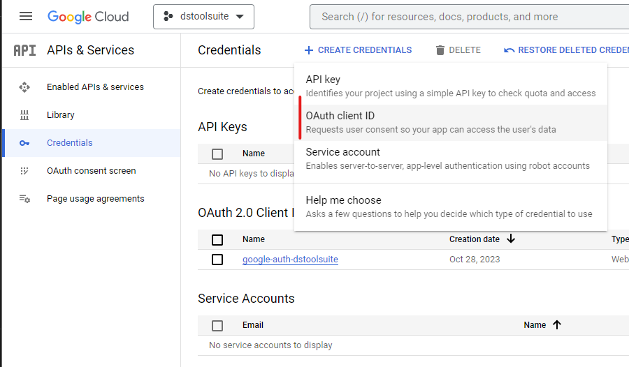

## Setup

1. Copy template to a new folder
2. Create a database for the project on [upstash redis](https://console.upstash.com/)
3. Create a new google cloud project and [create an OAUth-Client-ID](https://console.cloud.google.com/apis/credentials?project=dstoolsuite) (first need to update the [OAuth consent screen](https://console.cloud.google.com/apis/credentials/consent?project=dstoolsuite))

    <details>
    <summary>Screenshot</summary>

    
    </details>

3. Create an .env.local file

    ```.yml
    NEXTAUTH_SECRET=GENERATE_A_SECRET_AND_PASTE_HERE
    NEXTAUTH_URL=http://localhost:3000

    UPSTASH_REDIS_REST_URL=COPY_FROM_UPSTASH_REDIS
    UPSTASH_REDIS_REST_TOKEN=COPY_FROM_UPSTASH_REDIS

    # https://www.youtube.com/watch?v=A5ZN--P9vXM&ab_channel=CodeCommerce
    # https://console.cloud.google.com/apis/credentials
    GOOGLE_CLIENT_ID=COPY_FROM_GOOGLE_CLOUD
    GOOGLE_CLIENT_SECRET=COPY_FROM_GOOGLE_CLOUD
    ```


## Notes
Following this tutorial: [Youtube](https://www.youtube.com/watch?v=NlXfg5Pxxh8&t=6265s&ab_channel=VisualStudioCode)

NextAuth [Google Provider](https://next-auth.js.org/providers/google)